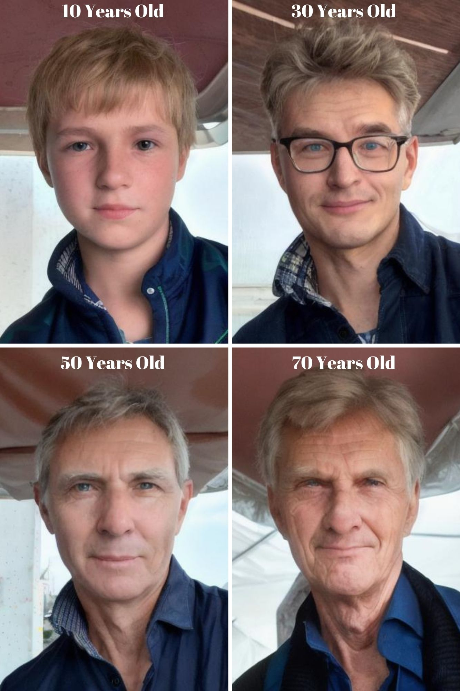

# Aging Time Lapse using Stable Diffusion 
<a name="readme-top"></a>

<!-- ABOUT THE PROJECT -->
## Introduction
In the realm of digital image processing, the simulation of aging effects has captivated both researchers and artists alike, offering a fascinating glimpse into the passage of time and its impact on the human form. Through the utilization of advanced machine learning techniques such as stable diffusion, the task of generating realistic aging time lapses has become not only achievable but also remarkably nuanced and compelling.

Aging time lapse tasks involve the transformation of an individual's appearance across various stages of their life span, from youth to old age, with each stage reflecting the gradual accumulation of age-related features such as wrinkles, skin texture changes, and hair graying. The challenge lies in creating a seamless and natural progression that accurately captures the complexities of the aging process while preserving the individual's unique characteristics and identity.

Stable diffusion, with its ability to manipulate images in a controlled and coherent manner, presents an ideal framework for tackling the complexities of aging simulation. By iteratively diffusing information across multiple scales and resolutions, stable diffusion techniques enable the gradual introduction of age-related modifications while maintaining the structural integrity and visual fidelity of the original image.

This task invites participants to explore the possibilities of aging time lapse generation through the lens of stable diffusion, leveraging its capabilities to create compelling and realistic portrayals of individuals aging over time. By adjusting key visual attributes such as skin tone, facial contours, and hair characteristics, participants can craft time lapse sequences that evoke the passage of years with authenticity and depth.

Beyond technical prowess, this task also calls for creativity, empathy, and a nuanced understanding of the aging process. Participants are encouraged to approach the task with sensitivity, respecting the dignity and humanity of the individuals depicted while exploring the profound narrative potential inherent in the aging experience.

Ultimately, the goal of this task is to showcase the transformative power of stable diffusion in the realm of aging simulation, demonstrating its capacity to generate evocative and emotionally resonant time lapse sequences that offer new insights into the human condition and the inexorable march of time. Through innovation, artistry, and a commitment to excellence, participants have the opportunity to contribute to the ongoing exploration of aging and its profound implications for society and culture.



<!-- ARCHITECTURE -->
## Architecture
Stable Diffusion, a latent text-to-image diffusion model released in 2022, employs latent diffusion models (LDMs). LDMs iteratively reduce noise in a latent representation space and convert it into complete images. The text-to-image generation process involves an Image Encoder, Text Encoder, Diffusion Model, and Image Decoder. The Image Encoder and Text Encoder transform images and text into latent representations, the Diffusion Model generates new images guided by text, and the Image Decoder reconstructs images from the latent space. Stable Diffusion excels in generating detailed images from text and supports tasks like inpainting and image-to-image translations. Its weights, model card, and code are publicly available.

The model used in this project is called "Realistic Vision". Realistic Vision is an all-rounded model for generating photograph-style images. In addition to realistic people, it is also good for products and scenes. Please visit this <a href="https://civitai.com/models/4201/realistic-vision-v60-b1">link</a> to see details.
<p align="right">(<a href="#readme-top">Back to Top</a>)</p>

<!-- Used Technologies -->
## Used technologies
### FastAPI
FastAPI is a modern, fast (high-performance), web framework for building APIs with Python 3.7+ based on standard Python type hints. It is designed to be easy to use, while also being fast and efficient. Some key features and advantages of FastAPI include:

* Fast and High Performance: FastAPI is built on top of Starlette and Pydantic, utilizing asynchronous programming to achieve high performance. It is one of the fastest web frameworks available for Python.

* Automatic API Documentation: FastAPI automatically generates interactive API documentation (using Swagger UI and ReDoc) based on the Python type hints, making it easy for developers to understand, test, and consume the API.

* Type Hints and Data Validation: FastAPI uses Python type hints for request and response data, enabling automatic data validation. This helps catch errors early in the development process and improves the overall reliability of the API.

* Dependency Injection System: FastAPI provides a built-in dependency injection system, making it easy to manage and inject dependencies into route functions.

* Security: It comes with built-in security features, such as OAuth and JWT token support, which simplifies the implementation of secure authentication and authorization in APIs.

* WebSocket Support: FastAPI supports WebSocket communication, allowing real-time bidirectional communication between clients and the server.

* Synchronous and Asynchronous Code: FastAPI supports both synchronous and asynchronous code, making it flexible for different use cases and allowing developers to leverage the benefits of asynchronous programming when needed.

* Easy Integration with Other Libraries: FastAPI seamlessly integrates with other popular Python libraries and frameworks, such as SQLAlchemy, Tortoise-ORM, and others.

* Automatic Generation of API Client Code: Using the generated OpenAPI documentation, FastAPI can automatically generate API client code in multiple programming languages, reducing the effort required to consume the API.

* Active Development and Community Support: FastAPI is actively developed and has a growing community. The framework is well-documented, and its community actively contributes to its improvement.

Overall, FastAPI is a modern and powerful web framework that prioritizes developer productivity, type safety, and high performance, making it an excellent choice for building APIs with Python.

### Uvicorn
Uvicorn is an ASGI (Asynchronous Server Gateway Interface) server that is specifically designed to run ASGI applications, such as those built with the FastAPI web framework. ASGI is a specification for asynchronous web servers and applications in Python, providing a standard interface between web servers and Python web applications or frameworks.

Here are some advantages of using Uvicorn:

* ASGI Support: Uvicorn supports the ASGI specification, which is designed to handle asynchronous programming and enables the development of highly concurrent web applications.

* Fast and Efficient: Uvicorn is known for its high performance and efficiency, making it well-suited for handling concurrent connections and delivering fast responses.

* Compatibility with FastAPI: Uvicorn is the recommended server for running FastAPI applications. When paired with FastAPI, it allows developers to take full advantage of asynchronous programming and achieve optimal performance.

* Ease of Use: Uvicorn is easy to install and use. It can be started with a single command, making it accessible for developers at all levels.

* WebSocket Support: Uvicorn supports WebSocket communication, allowing real-time bidirectional communication between clients and the server. This is particularly useful for applications that require real-time updates.

* Graceful Shutdown: Uvicorn supports graceful shutdowns, allowing existing requests to finish processing before the server stops. This helps maintain the stability and reliability of the application.

* Configuration Options: Uvicorn provides various configuration options, allowing developers to customize the server settings based on the requirements of their applications.

* TLS/SSL Support: Uvicorn supports TLS/SSL encryption, providing a secure way to transmit data over the network.

* Active Development and Community Support: Uvicorn is actively maintained and has a supportive community. Regular updates and contributions from the community ensure that the server stays up-to-date and improves over time.

* Integration with Other ASGI Frameworks: While commonly used with FastAPI, Uvicorn is not limited to a specific framework. It can be used with other ASGI frameworks and applications, providing flexibility and compatibility.

In summary, Uvicorn is a versatile and performant ASGI server that excels in handling asynchronous web applications. Its compatibility with FastAPI and support for WebSocket communication make it a popular choice for developers building modern, real-time web applications with Python. 

For this project, Uvicorn is using 3 workers. This means there will 3 subprocesses and the users can send requests in parallel. With this feature, the server can accept more than one request at the same time. You can increase the worker number regarding to your VRAM.

<p align="right">(<a href="#readme-top">Back to Top</a>)</p>

<!-- GETTING STARTED -->
## Getting Started - Python
Instructions on setting up your project locally.
To get a local copy up and running follow these simple steps.

### Install dependencies
To install the required packages, in a terminal, type:
  ```sh
  pip install -r requirements.txt
  ```

### Download model
To download the model, in a terminal, type:
  ```sh
  wget https://huggingface.co/spaces/nuwandaa/adcreative-demo-api/resolve/main/weights/realisticVisionV60B1_v20Novae.safetensors\?download\=true --directory-prefix weights --content-disposition
  ```

### Run the project
To run the project, in a terminal, type:
  ```sh
  uvicorn app:app --proxy-headers --host 0.0.0.0 --port 8000 --workers 3
  ```
Then, visit <a href="http://localhost:8000/docs">http://localhost:8000/docs</a> to see the endpoints.

## Getting Started - Docker
Instructions on setting up your project locally using Docker.
To get a local copy up and running follow these simple steps.

### Build Docker
To build the Docker image, in a terminal, type:
  ```sh
  docker build -t gender_swap -f Dockerfile .
  ```

### Run the container
To run the container, in a terminal, type:
  ```sh
  docker run -it -d --gpus all --name gender_swap -p 80:80 gender_swap
  ```
Then, visit <a href="http://localhost/docs">http://localhost/docs</a> to see the endpoints.

<p align="right">(<a href="#readme-top">Back to Top</a>)</p>
